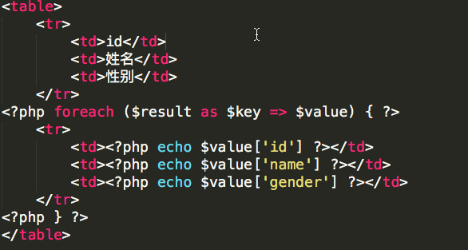

##文件引入
- php文件引入使用的语句
> 1、include 
2、require 
3、include_once
4、require_once

- 语句的作用
>include （或 require）语句会获取指定文件中存在的所有文本/代码/标记，并复制到使用 include 语句的文件中。
包含文件很有用，如果您需要在网站的多张页面上引用相同的 PHP、HTML 或文本的话。

- 语句的区别
>1.include_once与require_once在引入文件时，会检测该文件是否在之前已经被引入过，如果已经被引入被引入过则直接返回TRUE。如果没有被引入过，则引入文件。而其他两个函数不会对文件是否被重复引入做出检测。
2.include与include_once在引入文件失败时，只会产生警告信息，但不会终止程序继续向下执行。
而require与require_once引入文件失败时，会产生致命错误，并终止整个程序的运行。

	引入失败举例：
<pre><code>include './mysql.class.php';//没有这个文件
echo '程序继续执行了';</code></pre>
>**Warning:** include(./mysql.class.php): failed to open stream: No such file or directory in /Users/sycjyy/Sites/sqltest/include_test.php on line 11
>**Warning:** include(): Failed opening './mysql.class.php' for inclusion (include_path='.:') in /Users/sycjyy/Sites/sqltest/include_test.php on line 11
>程序继续执行了

	<pre><code>require './mysql.class.php';//没有这个文件
echo '程序继续执行了';</code></pre>
>**Warning:** require(./mysql.class.php): failed to open stream: No such file or directory in /Users/sycjyy/Sites/sqltest/include_test.php on line 14
>**Fatal error:** require(): Failed opening required './mysql.class.php' (include_path='.:') in /Users/sycjyy/Sites/sqltest/include_test.php on line 14

- 引用路径问题
共有三种路径：相对路径、绝对路径、未确定路径
	+ 相对路径：相对路径指以.开头的路径，例如
	<pre><code>include './file1.php'
include '../file2.php'</code></pre>
	+ 绝对路径：绝对路径是以 / 开头或者windows下的 C:/ 类似的盘符开头的路径，全路径不用任何参考路径就可以唯一确定文件的最终地址。 例如
	<pre><code>include '/apache/wwwroot/site/a/a.php'
include 'c:/wwwroot/site/a/a.php'</code></pre>
	+ 未确定路径：凡是不以 . 或者 / 开头、也不是windows下 盘符:/ 开头的路径，例如
	<pre><code>include 'file.php'</code></pre>

	举例：有一张目录结构图
			
	**相对路径**：引入文件一切都是相对于入口文件的，一定要记住这一点。
	下面是引用文件过程和代码。
	<pre><code>//在入口文件中引入file2.php
include "./dir2/file2.php";</code></pre>
<pre><code>//在file2.php文件中引入file1.php
echo "我是dir2中的file2.php ";
include './dir1/file1.php';</code></pre>
<pre><code>//在file1.php文件中引入file22.php
echo "我是dir1中的file1.php ";
include './dir2/dir22/file22.php';</code></pre>
<pre><code>//在file22.php文件中引入file21.php
echo "我是dir22中的file22.php ";	
include './dir2/dir21/file21.php';</code></pre>
	**绝对路径**：绝对路径比较简单，不容易混淆出错。
	<pre><code>//第一种直接写绝对路径
include "/Users/sycjyy/Sites/sqltest/dir2/file2.php";
// 第二种用dirname(__FILE__)
$dir = dirname(__FILE__);//计算出来的也是一个绝对路径形式的目录，但是要注意__FILE__是一个Magic constants，不管在什么时候都等于写这条语句的php文件所在的绝对路径
include $dir.'/dir2/file2.php';</code></pre>
	**未确定路径**：首先在逐一用include_path中定义的包含目录来拼接[未确定路径]，找到存在的文件则包含成功退出，如果没有找到，则用执行require语句的php文件所在目录来拼接[未确定路径]组成的全路径去查找该文件，如果文件存在则包含成功退出，否则表示包含文件不存在，出错。 未确定路径比较容易搞混不建议使用。
	---
##实例：
演示从数据库拿数据后显示前端页面（一个文件拆分成多个文件）
<pre><code><?php
	$link = @mysql_connect('localhost','root','12345678') or die('连接数据库失败');//连接数据库
mysql_query("set names utf8");//设置字符集
mysql_query("use php;");//选择数据库
$sql = 'select *from stu;';
$re = mysql_query($sql);//执行查询语句
//将查询结果转换成二维数组
$result = array();
while ($rec = mysql_fetch_array($re)) {
	$result[] = $rec;
}</code></pre>
将结果集result放到页面显示，接着上面的代码接着写：

这是一个php文件
